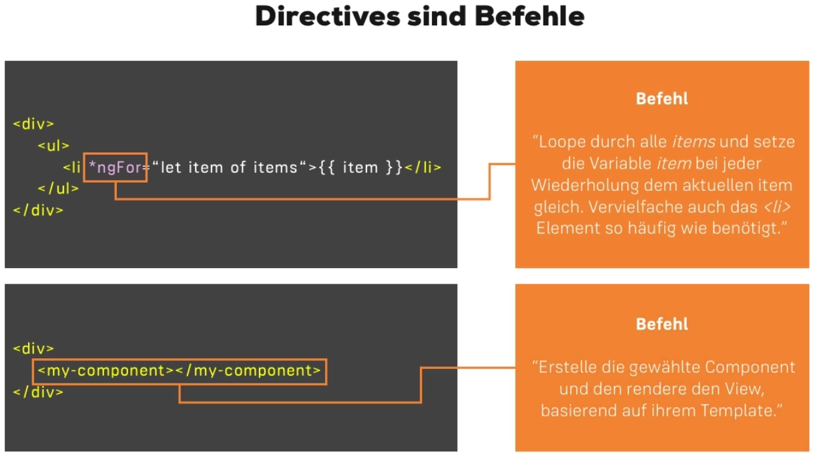
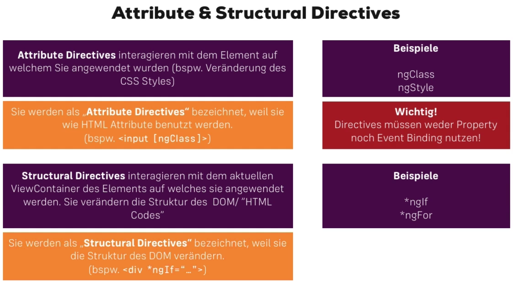
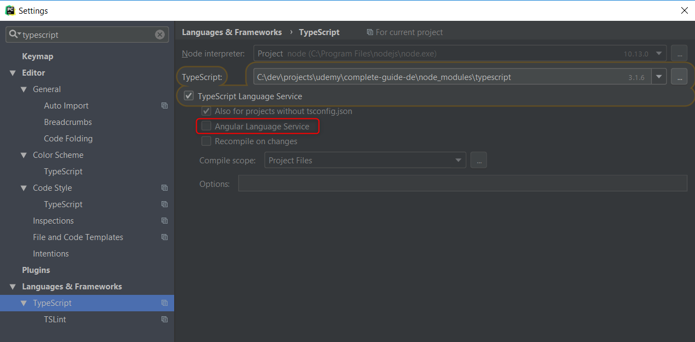

# CompleteGuideDe

This project was generated with [Angular CLI](https://github.com/angular/angular-cli) version 7.0.3 for following the Udemy course '[Angular 2 verstehen und anwenden](https://www.udemy.com/der-angular-2-kurs/)'

<a name="toc"></a>
## Table of Content
1. [prerequisite](#prerequisite)
1. [Clone Project](#clone_project)
1. [New Project](#new_project)
1. [Angular CLI Server starten](#start_server)
1. [Troubleshooting: Angular CLI / Angular 2 Setup](#troubleshooting_setup)
1. [Dateien und Verzeichnisse im Angular CLI (Auswahl)](#files_and_folders)
1. [TypeScript](#typescript)
1. [What are Components?](#whatcomponentsare)
1. [Databinding](#databinding)
   1. [String Interpolation](#string_interpolation)
   1. [Property Binding](#property_binding)
   1. [Event Binding](#event_binding)
   1. [Two-Way Binding](#two-way_binding)
1. [working closer with Angular HTML Template](#working_closer_with_angular_html_template)
1. [Component Lifecycles](#component_lifecycles)
1. [Section 3 - Start App dev (Components and Databinding)](#sec3_start)
   1. [An Angular Datamodel](#sec3_datamodel)
1. [Section 4 - Directives](#sec_4_directives)
   1. [@HostBinding](#sec_4_hostbinding)
   1. [@HostListener](#sec_4_hostlistener)
1. [Problems/Questions](#problems_questions)

## meine Konvention in dieser Datei
'[c.s]' in headlines showing the corresponding course (c)hapter and (s)ection

g.E.: [1.6] means chapter 1, section 6

<a name="prerequisite"></a>
## prerequisite [↸](#toc)

### Node.JS
Installed? Test with `npm -v` on commandprompt. Otherwise:  
- [download](https://nodejs.org/de/) an install node

### AngularCLI  
Install with:
 `npm install -g @angular/cli`

<a name="clone_project"></a>
### Cloning this Tutorial Project [↸](#toc)
In the next chapter the project will be build from the beginning. But you
can clone the project from GitHub too. In subsequent to this case Angular 
CLI has to install necessary files and folders and **the following chapter
'New Project' is obsolete** 😉

1. open a shell and navigate to the folder where you want to install this
   project
2. `git clone https://github.com/dele1972/complete-guide-de.git`
3. `cd complete-guide-de`
4. `npm install`

---
<a name="new_project"></a>
## New Project [↸](#toc)
(*branch from here: [`3rdStep/templateAndLifecycle`](https://github.com/dele1972/complete-guide-de/tree/3rdStep/templateAndLifecycle)*)  

**Neues Angular Projekt erstellen**:
(*only necessary if project isn't be cloned*)
```
ng new complete-guide-de
```

Das Projektverzeichnis: `c:\dev\projects\udemy\complete-guide-de`

---
<a name="start_server"></a>
## Angular CLI Server starten [↸](#toc)
per Standard wird port 4200 verwendet, unser CP läuft lokal auch darüber, also einen neuen Port zum Spielen angeben
	`complete-guide-de>ng serve --port 4201`

### Für Webstorm Angular CLI Server run, Port in angular.json angepasst
`C:\dev\projects\udemy\complete-guide-de\angular.json`, dort unter `'options'`:
```
	{"projects": {
		"complete-guide-de": { 
			"architect": { 
				"serve": { 
					"options": 
					}
				}
			}
		}
	}
```
... folgendes key/val Paar hinzugefügt: `"port": 4201`

---
<a name="troubleshooting_setup"></a>
## Troubleshooting: Angular CLI / Angular 2 Setup [1.6] [↸](#toc)
Normalerweise sollte sowohl bei der Installation des CLI als auch beim Erstellen und Starten der Angular 2 App alles problemlos funktionieren.

Hier sind ein paar Hinweise falls es zu Problemen kommt:

**Generell**

Stellt sicher, dass die letzte (höchste) Version von NodeJS installiert ist.

*Auf Windows*: Falls es zu Problemen kommt oder das Erstellen eines Projekte lange dauert: Versucht die Eingabeaufforderung im Administratormodus zu starten

*Windows 10 und Node 7.1*
Es scheint einen Bug in Node 7.1 auf Windows 10 zu geben (Fehler: "this socket is closed"). Die Lösung ist, temporär auf Node 7.0 umzusteigen

**CLI Version Updaten**

Möglicherweise wurde das Angular CLI schon einmal verwendet und installiert, ein Update kann hier viele Probleme lösen.

Dabei sind die folgenden Schritte auszuführen (sudo  nur auf Mac/ Linux verwenden):
```
		[sudo] npm uninstall angular-cli -g
		npm cache clean
		[sudo] npm install angular-cli@latest -g
```

---
<a name="files_and_folders"></a>
## Dateien und Verzeichnisse im Angular CLI (Auswahl) [1.9] [↸](#toc)
```
  Project/
		e2e/					    end-to-end tests via Protractor
		src/					    sources of the app
		angular.json			angular configuration
		package.json			some dependencies

	Project/src/
		app/
		assets/					  Pictures
		environments/			for build process
		...
		index.html				project html 'container'
		styles.css				global project styles
		main.ts
		polyfills.ts			project/app dependencies
		...
		
	Project/src/app/
		app.component.css		    specific styles for this app
		app.component.html		  will be placed in (app.component.ts defined selector) <app-root> container of global src/index.html
		app.component.spec.ts	  used for unit tests via Karma (can be deleted)
		app.component.ts		    typescript code
		app.module.ts
```

---
<a name="typescript"></a>
## TypeScript [1.10] [↸](#toc)
* erweitert JS u.a. um: (explizite) Typen, Klassen, Module, ...
* wird zu JS kompiliert
* `npm install typescript -g`
* String über mehrere Zeilen:
    \`mit  
	  back-ticks\`

---
<a name="whatcomponentsare"></a>
## What are Components? [↸](#toc)
Folgende Grafik zeigt eine mögliche Aufteilung einer Webseite in 
Components:

### app.component.ts [2.13]
* `@component` ist ein decorator mit dessen die ts klasse zu einer component wird
* selector: selektion mit der dann die komponente ersetzt wird
  * `'app-root'` -> es wird das Element <app-root> ersetzt
  * `'#app-root'` -> es wird jede ID app-root ersetzt
  * `'.app-root'` -> es wird jede Klassse app-root ersetzt
  * siehe hierzu src/main.ts und src/app/app.module.ts
* template muss nicht eine externe Datei sein, sondern kann auch html-abschnitt als string angegeben werden [2.14]

### components anlegen [2.15]
1. manuell (Dateien selbst anlegen)
  * `apps/other/` anlegen
  * `apps/other/other.componient.html` anlegen
  * `apps/other/other.componient.ts` anlegen
  * `src/app/app.module.ts` modifizieren
2. per CLI (Command Line Interface):
  * lange Version: `ng generate component <Name der Komponente> [optionen]`
  * kurzschreibweise: `ng g c <Name der Komponente> [optionen]`
  * optionen [2.17]
    * `--flat`							          keinen Unterordner erstellen
    * `--inline-template` oder `-it`	keine extra html-tmpl datei erstellen
    * `--inline-styles` oder `-is`		keine extra css datei erstellen
    * `--spec false`					        keine Unit-Testdatei erstellen

### component css [2.18]
* css in der component definiert, gilt nur für diese component, nicht für childs!
* Stichwort: ShadowDOM
* jedes css gestylte element bekommt ein component eigenes attribut und wird beim endprodukt (der html seite) dann zu beginn entsprechend gestylte

---
<a name="databinding"></a>
## Databinding [2.20] [↸](#toc)
### Methoden
1. **String Interpolation**: `{{ Ausdruck, der in einen String resultiert }}`
2. **Property Binding**: `<button [disabled]="Ausdruck, der in einen benötigten Property Type resultiert">`
3. **Event Binding**: `<button (click)="Ausdruck, das das Event behandelt">`
4. **Two-Way Binding**: `<input [(ngModel)]="gebundene Datenquelle">`

<a name="string_interpolation"></a>
#### 1) String Interpolation [2.21] [↸](#toc)
(*branch from here: [`2ndStep/databinding`](https://github.com/dele1972/complete-guide-de/tree/2ndStep/databinding)*)  

Angular 2 Feature **change detection** sorgt dafür, Änderungen festgestellt 
werden und dann die Werte beim `databinding` aktualisiert. Hier wurde z. B. 
in `databinding.component.ts` ein Konstruktor hinzugefügt, welcher die 
asynchrone Funktion `setTimeout()` verwendet um die *property* 
`aNumberProperty` nach drei Sekunden zu erhöhen.  

Dafür gibt es unter Angular2 ein paar Events die eine Aktualisierung 
erkennen. Das Fertigstellen von asynchronen Funktionen (wie `setTimeout()`) 
ist eins dieser Events

<a name="property_binding"></a>
### 2) Property Binding [2.22-2.24] [↸](#toc)
  
#### bind a HTML Property (`value`)
```html
<input type="text" [value]="aNumberProperty">
```

#### bind an Angular Property ([`[ngClass]`](https://angular.io/api/common/NgClass)) [2.23]
In this Example the Angular `ngClass` Directive is used. Data will be transmitted via property binding.
This Directive supports three Value types:
1. String (`'first second'`)
2. Array (`['first', 'second']`)
3. Object (`{'first': true, 'second': false}`)  

The following Example uses type 'Object'. Therefore we build an Object, with the
 css classname as keyname and a String Interpolation as Value. 'red-border' is 
 defined by src/app/databinding/databinding.component.ts:styles and 'myAttachClass'
 is defined in databinding.component.ts too.
```html
<div [ngClass]="{'red-border': myAttachClass}">Text</div>
```

#### custom properties [2.24]
New App/Component added: `ng g c property-binding --flat --spec false -it -is`
If we want to use external Values via a component side property, this property 
has to be set with the `@Input()` Decorator which has to be imported too:
```angular
import { ..., Input } from '@angular/core';
export class ComponentClassName {
  @Input() propertyName: string; // Type assignment with Typescript
}
``` 
see also: [Type assignment with Typescript](https://www.typescriptlang.org/docs/handbook/basic-types.html)

#### alternate Property Binding [2.27]
With `@Input()` we configure property binding - therefor we have to:
* import `Input` Module (from `@angular/core`)

Alternatively you can add a new key `inputs: ['propertyName(s)']` to the component Decorator. 
Then you don't need to import the `Input` Module and don't have to use the `@Input()` Decorator 
for each Property of the component class. But the other way is more than less best practice 😉

#### alternate binding name (alias) for outer access
`@Input('outerPropertyName') innerPropertyName: TYPE;`  
This alias is mandatory for the accessibility of this property from other components.

<a name="event_binding"></a>
### 3) Event Binding [2.25] [↸](#toc)
[`ngClick`](https://docs.angularjs.org/api/ng/directive/ngClick)  

#### click Event with inline Angular-Code
```html
<button (click)="myAttachClass=false">click me!</button>
```

#### click Event with Angular-Component-Function
`myOnClick()` is defined in `src/app/databinding/databinding.component.ts`
```html
<button (click)="myOnClick($event)">click me too!</button>
```
[`$event`](https://docs.angularjs.org/guide/expression#-event-) is an Angular Object - this is the actual

##### custom event [2.26]
New App/Component added: `ng g c event-binding --flat --spec false -it -is`   

Now we don't want a mother:daughter transmitting but a daughter:mother. This
will be done by a new Event - [`new EventEmitter`](https://angular.io/api/core/EventEmitter)
a module that has to be imported by the component.  

`newEventEmitter<string>()` EventEmitter is a generic type, so we can define 
the used data type with `<>`. In this case a string.  
With [`emit`](https://angular.io/api/core/EventEmitter#emit) we can fire an 
event - `this.clicked.emit('my new Text');` will fire the custom `clicked` 
Event with `'my new Text'` as `$event` Data.  

Because we want to use this custom Event from outside of the component, this
has to be defined with the `@Output()` Decorator, which must be imported too.  
`@Output() clicked = new EventEmitter<string>();`

```html
<app-event-binding (clicked)="aStringProperty = $event"></app-event-binding>
```
`$event` stores the Event-Data (in this case `'my new Text'` from the emit
 call) and will be copied to the `aStringProperty` Property.

<a name="two-way_binding"></a>
### 4) Two-Way Binding [2.28] [↸](#toc)
#### long way 'manually'
Example:  
```html
<input type="text" [value]="aStringProperty" (keyup)="aStringProperty = thisInputElement.value" #thisInputElement>
```

#### short way 'ngModel'
Uses [`ngModel`](https://angular.io/api/forms/NgModel)  
which needs the NgModule `FormsModule` imported by `app.module.ts`:
* `import {FormsModule} from '@angular/forms';` and
* `@NgModule({`  
      `...`  
      `imports: [`  
       `...,`  
       `FormsModule`  
  `],`  

Example:
```html
<input type="text" [(ngModel)]="aStringProperty">
```

---
<a name="working_closer_with_angular_html_template"></a>
## working closer with Angular HTML Template [2.29] [↸](#toc)
(*branch from here: [`3rdStep/templateAndLifecycle`](https://github.com/dele1972/complete-guide-de/tree/3rdStep/templateAndLifecycle)*)  

New App/Component added: `ng g c other --flat --spec false -it -is`   

### [Template reference variables](https://angular.io/guide/template-syntax#ref-vars) [2.29]
`#thisInputElement`: with `#` builds Angular a reference to the Element 

#### Trigger the 'change detection' Trick [2.29]
```html
<input type="text" #input (keydown)="0"/>
```
To start the change detection, use `(keydown)` or another event with nothing. 
In this case `input.value` will change by using as String Interpolation elsewhere.

### data exchange Angular Typescript with Template Element ([`@ViewChild`](https://angular.io/api/core/ViewChild))
export class:
* define reference: `@ViewChild('inputRef') inputEl[: ElementRef];`  
  * `ViewChild` Modul has to be imported
  * `[]` shows optional enhancement for Type specification
* use: `this.inputEl.nativeElement.value = 'New String Value';`

### data exchange Angular Typescript with 'mother' Element via `ng-content`  ([`@ContenChild`](https://angular.io/api/core/ContentChild))
export class:
* define reference: `@ContenChild('paragraphRef') pEl: ElementRef;`  
  * `ContentChild` Modul has to be imported
* use: `this.pEl.nativeElement.innerText = 'New String Value';`
  * `innerText`, because in this example the inner Text of the 
  `<ng-content>` element has to be overwritten (more accurate: 
  `<app-other><p #paragraph>Some Text</p></app-other>`)

---
<a name="component_lifecycles"></a>
## Component Lifecycles [2.30] [↸](#toc)
(*branch from here: [`4thStep/lifecycle`](https://github.com/dele1972/complete-guide-de/tree/4thStep/lifecycle)*)  


New App/Component added: `ng g c lifecycle --flat --spec false -it -is`   

In this Branch for each Hook is a log added. To see ngOnChanges, there is a
little 'destroy' Button implemented (via `*ngIf`).

---
<a name="sec3_start"></a>
## Section 3 - Start App dev (Components and Databinding) [3.33] [↸](#toc)
(*branch from here: [`section3/1-components-databinding-start`](https://github.com/dele1972/complete-guide-de/tree/section3/1-components-databinding-start)*)  

By installing Bootstrap via `npm`, it can be used by adding bootstrap styles 
in `angular.json`:  
```json
"styles": [
  "../node_modules/bootstrapp/dist/css/bootstrap.min.css",
  "styles.css"
],
```

### generate Components for the recipe app [3.36]
1. `ng g c header --flat --spec false -is`   
2. `ng g c recipe --spec false -is`   
3. `ng g c shopping-list --spec false -is`   
4. `cd src/app/recipe`   
5. `ng g c recipe-list --spec false -is`   
6. `ng g c recipe-detail --spec false -is`   
7. `cd recipe-list`   
8. `ng g c recipe-item --flat --spec false -is`   

<a name="sec3_datamodel"></a>
### A datamodel [↸](#toc)
Goal: create a new file with a class definition, to handle data

#### build a model [3.37] 
Add a model `recipe/recipe.model.ts` to store values for the App.

☝ This is a short form of building ts properties, naming parameters and 
bind the parameters to the properties. 
```typescript
constructor(public name: string, public description: string, public imagepath: string) {
  //...
  }
```

#### use model
`src/app/recipe/recipe-list/recipe-list.component.ts`:  
`import { Recipe} from '../recipe.model';`
`recipe = new Recipe('Dummy', 'Dummy', 'http://placeimg.com/320/240/tech');`

`src/app/recipe/recipe-list/recipe-item.component.ts`:
`@Input() recipe: Recipe;`

`src/app/recipe/recipe-list/recipe-list.component.html`
`<app-recipe-item [recipe]="recipe"></app-recipe-item>`
`[recipe]` ⟶ recipe-item.component.ts
`recipe`  ⟶ mother: recipe-list.component.ts

#### output model
`src/app/recipe/recipe-list/recipe-item.component.html`:
````html
  <div class="pull-left">
    <h4 class="list-group-item-heading">{{ recipe.name }}</h4>
    <p class="list-group-item-text">{{ recipe.description }}</p>
  </div>
  <div class="pull-right">
    
  </div>
````

#### recipe-details [3.39] ☝⚠
`src/app/recipe/recipe-detail/recipe-detail.component.ts`:
`@Input() selectedRecipe: Recipe;`

`src/app/recipe/recipe-detail/recipe-detail.component.html`:
Problem -  actually is recipe-detail always shown, but if no recipe is
selected, `selectedRecipe.name` would be undefined.
`<h1>{{ selectedRecipe?.name }}</h1>`
With `?` Angular will only access to `selectedRecipe` if it isn't undefined
or NULL 

### a click-property-component-chain (longway) [3.40]
1. **emit first Event** during onSelect() in 
   `recipe-list/recipe-item.component.ts`
   and send `this.recipe`
2. **get** this **event** at mother component level in 
   `recipe-list.component.html` and 
3. **pass data** via `onSelected($event)`
   in `recipe-list.component.ts` and
4. **emit 2nd Event** by passing $event as Recipe Object
5. This **Event** is **captured** by `recipe.component.html`
   and will be used by `recipe.component.ts`
   * `[selectedRecipe]` belongs to `recipe-detail.component.ts: @Input() selectedRecipe: Recipe;`
   * `selectedRecipe` belongs to `recipe.component.ts:10`
   * `(recipeSelected)` belongs to `recipe-list.component.ts`

### adding grocery-list [3.41]
1. `cd src/app/shopping-list`   
2. `ng g c shopping-list-add --spec false -is --flat`   

---
<a name="sec_4_directives"></a>
## Section 4 - Directives [4.42] [↸](#toc)
(*branch from here: [`section4/directives-master`](https://github.com/dele1972/complete-guide-de/tree/section4/directives-master)*)  





### custom attribute directive [4.44]
Add New directive: `ng g d highlight`  
`d` is short form of `directive` 
```typescript
@Directive({
  selector: '[appHighlight]'
})
```
* The `@Directive` decorator has'nt got `template:` and `styles:` 
  elements/properties.  
* `[]` of `[appHighlight]` symbolize css attribute selector and not an angular
   property binding!  

```typescript
export class HighlightDirective {
  constructor(myElRef: ElementRef) {
    myElRef.nativeElement.style.backgroundColor = 'green';
  }
}
```
As Parameter of the constructor we could tell which dependencies we want to
use. Keyword for this behavior is **dependency injection** - which will be
closer treated later in the tutorial. It is possible to name a special class
or object.  
In this case we want to make a dependeny to the Element which will use our
directive as attribute. 

This Example is not best practice: **avoid the use of direct css attributes 
or HTML DOM references** - instead use Renderer2.setStyle(): [4.48]

```typescript
  constructor(myElRef: ElementRef, myRenderer: Renderer2) {
    // myElRef.nativeElement.style.backgroundColor = 'green';
    // myRenderer.setElementStyle(myElRef.nativeElement, 'background-color', 'red');
    myRenderer.setStyle(myElRef.nativeElement, 'background-color', 'red');
  }
```

<a name="sec_4_hostbinding"></a>
#### [`@HostBinding` Decorator](https://angular.io/api/core/HostBinding) [4.49] [↸](#toc)
For the Example before is this a **much simplier way**:  
`@HostBinding('style.backgroundColor') myColorProperty = 'blue';`  
`@HostBinding` is a decorator which supports access to a property of the 
actual Element where this Directive is situated.  
Within the brackets at first the property `style` is named - then the style
property in JS/DOM notation (see: [MDN: CSS Properties Reference](https://developer.mozilla.org/en-US/docs/Web/CSS/CSS_Properties_Reference)).  
`myColorProperty` is an Angular Property which is bound to the HostBinding 
Property.

<a name="sec_4_hostlistener"></a>
#### [`@HostListener` Decorator](https://angular.io/api/core/HostListener) [4.50] [↸](#toc)
This Decorator can handle [CSS Events](https://developer.mozilla.org/en-US/docs/Web/Events)
of the Element where this Directive is situated:
```typescript
  @HostListener('mouseenter') myMouseenter() {
    this.myColorProperty = 'silver';
  }
```

[HIER BIN ICH [4.51]](https://www.udemy.com/der-angular-2-kurs/learn/v4/t/lecture/6028422?start=0)

---
<a name="problems_questions"></a>
## Problems/Questions [↸](#toc)

### getting Browser Error "`[WDS] Disconnected!`"
WDS possible stands for webpack-dev-server, this is located/defined at `node_modules` Folder. 
Maybe in [this Stackoverflow Article](https://stackoverflow.com/questions/36917722/keep-getting-wds-disconnected-error) you find an answer... 

### IDE Error: "`Error:Initialization error (angular 2 language service). Cannot read property 'CommandTypes' of undefined`"
Sometimes the IDE freezes and TypeScript Console throws this stated Error.  

One occasion is to deactivate the Angular Service:  
Settings (Strg + Alt + S) → "Language & Frameworks" | "TypeScript"
 → deactivate "Angular Language Service"



---

## Development server

Run `ng serve` for a dev server. Navigate to `http://localhost:4200/`. The app will automatically reload if you change any of the source files.

## Code scaffolding

Run `ng generate component component-name` to generate a new component. You can also use `ng generate directive|pipe|service|class|guard|interface|enum|module`.

## Build

Run `ng build` to build the project. The build artifacts will be stored in the `dist/` directory. Use the `--prod` flag for a production build.

## Running unit tests

Run `ng test` to execute the unit tests via [Karma](https://karma-runner.github.io).

## Running end-to-end tests

Run `ng e2e` to execute the end-to-end tests via [Protractor](http://www.protractortest.org/).

## Further help

To get more help on the Angular CLI use `ng help` or go check out the [Angular CLI README](https://github.com/angular/angular-cli/blob/master/README.md).
